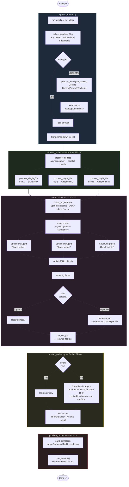

```mermaid

flowchart TD
    A([main.py]) --> B[run_pipeline_for_folder]

    subgraph RUNNER["pipeline_runner.py"]
        B --> C[collect_pipeline_files\nSort: RFP → Addendums → Supporting]
        C --> D{File type?}
        D -->|.md| E[Pass through]
        D -->|.pdf / .html| F[perform_intelligent_parsing\nDocling — DoclingParseV2Backend]
        F --> G[Save .md to\noutput/parsed/BidN/]
        G --> E
        E --> H[Sorted markdown file list]
    end

    subgraph SCATTER["scatter_gather.py — Scatter Phase"]
        H --> I[process_all_files\nasyncio.gather — parallel per file]
        I --> J1[process_single_file\nFile 1 — Base RFP]
        I --> J2[process_single_file\nFile 2 — Addendum 1]
        I --> J3[process_single_file\nFile N — Addendum N]
    end

    subgraph MAPREDUCE["map_reduce.py — per file"]
        J1 & J2 & J3 --> K[smart_rfp_chunker\nSplit by headings / Q&A / tables / prose]
        K --> L[map_phase\nasyncio.gather + Semaphore]
        L --> M1[StructuringAgent\nChunk batch 1]
        L --> M2[StructuringAgent\nChunk batch 2]
        L --> M3[StructuringAgent\nChunk batch N]
        M1 & M2 & M3 --> N[partial JSON objects]
        N --> O[reduce_phase]
        O --> P{Valid\npartials?}
        P -->|1 partial| Q[Return directly]
        P -->|N partials| R[MergerAgent\nCollapse to 1 JSON per file]
        Q & R --> S[per_file_json\n+ _source_file tag]
    end

    subgraph GATHER["scatter_gather.py — Gather Phase"]
        S --> T{Single\nfile?}
        T -->|Yes| U[Return directly]
        T -->|No| V[ConsolidationAgent\nAddendum overrides base RFP\nLast addendum wins on conflicts]
        U & V --> W[Validate via\nRFPExtraction Pydantic model]
    end

    subgraph OUTPUT["pipeline_runner.py — Output"]
        W --> X[save_extraction\noutput/extracted/BidN_result.json]
        X --> Y[print_summary\nFields extracted vs null]
    end

    Y --> Z([Done ✅])

    style RUNNER fill:#1e2a3a,stroke:#4f98a3,color:#cdccca
    style SCATTER fill:#1e2a1e,stroke:#6daa45,color:#cdccca
    style MAPREDUCE fill:#2a1e2a,stroke:#a86fdf,color:#cdccca
    style GATHER fill:#2a2a1e,stroke:#e8af34,color:#cdccca
    style OUTPUT fill:#2a1e1e,stroke:#dd6974,color:#cdccca

```
